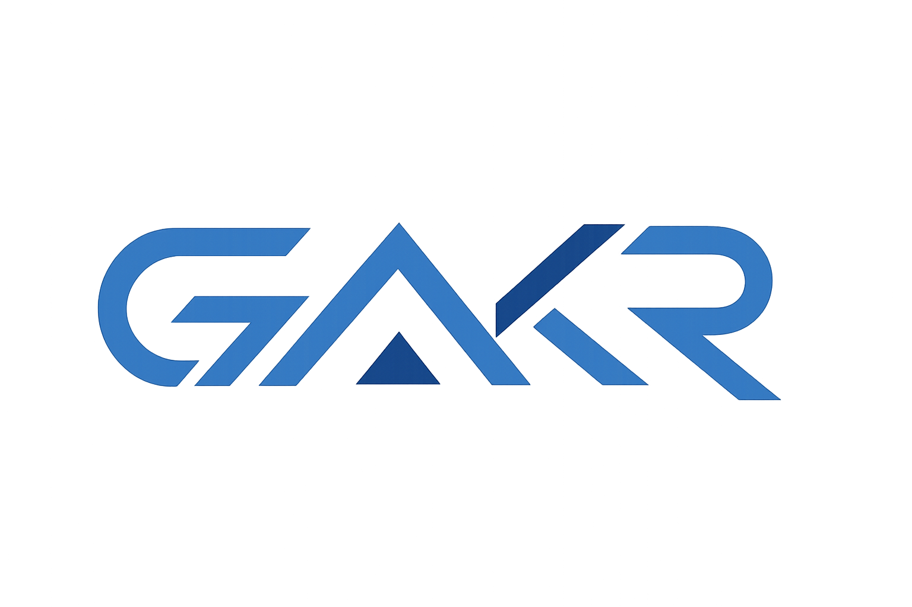

<div align="center">



# GakrCLI VS Code

**The open AI coding assistant for VS Code — powered by any LLM you choose.**

OpenAI · Anthropic · Google Gemini · DeepSeek · Ollama · AWS Bedrock · Vertex AI · GitHub Models · 200+ OpenAI-compatible endpoints.

[](https://marketplace.visualstudio.com/items?itemName=gakr-gakr.gakrcli-vscode)
[](https://marketplace.visualstudio.com/items?itemName=gakr-gakr.gakrcli-vscode)
[](LICENSE)

</div>

---

## What is GakrCLI?

GakrCLI is a **full-featured VS Code extension** that wraps the open-source [GakrCLI CLI](https://www.npmjs.com/package/@gitlawb/gakrcli) — an AI coding assistant that works with any LLM provider. The CLI handles all intelligence (tool use, provider routing, MCP, slash commands); the extension gives you a first-class editor experience: streaming chat panel, native diff viewer, @-mentions, session history, and more.

Unlike assistants locked to a single provider, GakrCLI lets you **bring your own model** — or switch between them mid-session.

---

## Features

### Chat & Conversation
- **Streaming chat panel** with markdown rendering and syntax-highlighted code blocks
- **Tool-call visualization** — collapsible blocks showing what the AI reads, edits, and runs
- **Session history** — browse, resume, or fork past conversations
- **Stop / interrupt** generation at any time
- **Conversation compacting** to manage token usage

### Native VS Code Integration
- **Diff viewer** — AI-proposed changes open in VS Code's built-in diff editor with Accept/Reject buttons
- **@-mentions** — reference files, folders, symbols, and line ranges for context
- **Status bar** with live provider/model info and token usage
- **5 permission modes** — Default, Accept Edits, Plan, Bypass, Full Access
- **Git worktree support** — parallel AI sessions on the same repo

### Multi-Provider
Switch providers on the fly via `/provider`, the provider badge, or environment variables:

| Provider | Setup |
|---|---|
| **OpenAI** | `OPENAI_API_KEY` |
| **Anthropic** | Claude Code OAuth or `ANTHROPIC_API_KEY` |
| **Google Gemini** | `GOOGLE_API_KEY` |
| **Ollama** | `OPENAI_BASE_URL=http://localhost:11434/v1` |
| **DeepSeek** | OpenAI-compatible endpoint |
| **AWS Bedrock** | AWS credentials |
| **Google Vertex AI** | GCP credentials |
| **GitHub Models** | GitHub PAT |
| **Custom** | Any OpenAI-compatible endpoint |

### Developer Tools
- **MCP (Model Context Protocol)** server integration
- **Plugin manager** — install, update, manage MCP plugins
- **Slash commands** — `/commit`, `/review`, `/diff`, `/resume`, `/compact`, `/mcp`, and more
- **Onboarding walkthrough** for new users

---

## Quick Start

### Prerequisites

```bash
npm install -g @gitlawb/gakrcli
```

The CLI is required — the extension is a UI wrapper around it.

### Install the Extension

```bash
code --install-extension gakr-gakr.gakrcli-vscode
```

Or search for **GakrCLI** in the Extensions panel (`Ctrl+Shift+X`).

### Configure a Provider

```bash
# OpenAI
export OPENAI_API_KEY=sk-your-key
export OPENAI_MODEL=gpt-4o

# Anthropic
export ANTHROPIC_API_KEY=sk-ant-your-key

# Ollama (local)
export OPENAI_BASE_URL=http://localhost:11434/v1
export OPENAI_MODEL=llama3

# Any OpenAI-compatible endpoint
export OPENAI_BASE_URL=https://api.deepseek.com/v1
export OPENAI_MODEL=deepseek-chat
```

Or use `/provider` interactively inside GakrCLI.

### Open and Use

- **`Ctrl+Escape`** (Windows/Linux) or **`Cmd+Escape`** (macOS)
- Click the GakrCLI icon in the Activity Bar
- Type your prompt, use `@` to reference files, `/` for commands

---

## Permission Modes

| Mode | Behavior |
|---|---|
| **Default** | Standard behavior; prompts for dangerous operations |
| **Accept Edits** | Auto-accepts file edit operations in the workspace |
| **Plan** | Analysis only; tool execution is blocked |
| **Bypass** | Skips normal permission prompts while preserving hard safety prompts |
| **Full Access** | Skips normal and hard safety-check prompts |

Change modes via the footer dropdown or the initial `gakrcli.initialPermissionMode` setting.

---

## Keyboard Shortcuts

| Action | macOS | Windows / Linux |
|---|---|---|
| Open / Focus GakrCLI | `Cmd+Escape` | `Ctrl+Escape` |
| Open in new tab | `Cmd+Shift+Escape` | `Ctrl+Shift+Escape` |
| Insert @-mention | `Alt+K` | `Alt+K` |
| New conversation | `Cmd+N` (opt-in) | `Ctrl+N` (opt-in) |

---

## Slash Commands

| Command | Description |
|---|---|
| `/provider` | Set up and switch LLM providers |
| `/model` | Switch between models |
| `/compact` | Compact conversation context |
| `/resume` | Browse and resume past sessions |
| `/diff` | Show current git diff |
| `/commit` | Create a git commit |
| `/review` | Review code or a PR |
| `/mcp` | Manage MCP servers |
| `/plugins` | Manage plugins |
| `/help` | Show all commands |

---

## Configuration

See [Configuration Reference](https://github.com/gajjalaashok75-UI/gakrcli-vscode/blob/main/docs/CONFIGURATION.md) for the full settings reference, or browse `gakrcli.*` settings in VS Code's Settings UI.

Key settings: `gakrcli.selectedModel`, `gakrcli.initialPermissionMode`, `gakrcli.preferredLocation`, `gakrcli.autosave`, `gakrcli.environmentVariables`, `gakrcli.apiKey`, `gakrcli.baseUrl`.

---

## Architecture

```
Webview (React + Tailwind)     ← UI: chat panel, diff, mentions
        │ postMessage
Extension Host (TypeScript)    ← VS Code integration, permissions, sessions
        │ stdin/stdout NDJSON
GakrCLI CLI (child process)    ← Intelligence: tools, providers, MCP, plugins
        │ OpenAI Chat Completions API
Any LLM provider               ← OpenAI / Anthropic / Gemini / Ollama / …
```

The extension is deliberately thin — all provider logic, tool execution, MCP, and slash-commands live in the CLI. Upgrading the brain means `npm install -g @gitlawb/gakrcli@latest` with no VS Code reinstall.

See [Architecture](https://github.com/gajjalaashok75-UI/gakrcli-vscode/blob/main/docs/ARCHITECTURE.md) for details.

---

## Documentation

- [Installation Guide](https://github.com/gajjalaashok75-UI/gakrcli-vscode/blob/main/docs/INSTALLATION.md)
- [Usage Guide](https://github.com/gajjalaashok75-UI/gakrcli-vscode/blob/main/docs/USAGE.md)
- [Permission System](https://github.com/gajjalaashok75-UI/gakrcli-vscode/blob/main/docs/PERMISSIONS.md)
- [Configuration Reference](https://github.com/gajjalaashok75-UI/gakrcli-vscode/blob/main/docs/CONFIGURATION.md)
- [Architecture](https://github.com/gajjalaashok75-UI/gakrcli-vscode/blob/main/docs/ARCHITECTURE.md)
- [Development Guide](https://github.com/gajjalaashok75-UI/gakrcli-vscode/blob/main/docs/DEVELOPMENT.md)
- [Publishing Guide](https://github.com/gajjalaashok75-UI/gakrcli-vscode/blob/main/docs/PUBLISHING.md)

---

## License

MIT — see [LICENSE](LICENSE).
